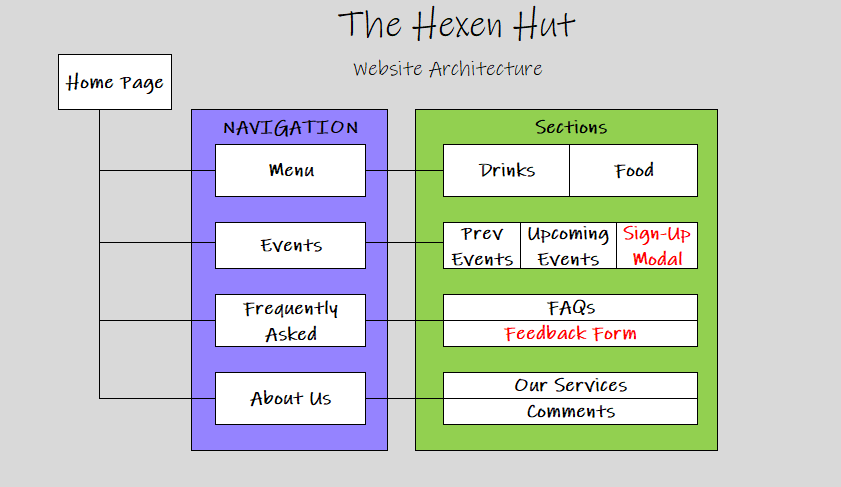
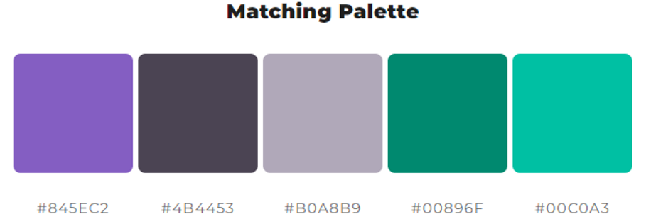

<h1 align="center">The Hexen Hut - A video games bar. </h1>

https://nyxhexen.github.io/CI_MS1_THH/

## Milestone Project 1

### *Project goal:*
- Build a static front-end site to present information to users using technologies learned - HTML and CSS. *Optional: Boostrap and/or other CSS libraries and/or frameworks.*

### *Project Requirements:*git 
- Custom HTML5 and CSS3 code to create at least 3 pages, or 3 separate page areas.
- Deploy final version to a hosting platform (GitHub Pages).

The site is written in HTML and CSS, using some of the pre-styled Bootstrap features and responsive elements to assist in creating a mobile-first web application. Future releases will introduce additional features and functionality to enhance the user experience further.

---

## Introduction

### __*The Bar*__
An all-inclusive community-oriented gaming bar in Cardiff, where people can use onsite equipment to play video games for free while enjoying drinks & food. Events are hosted regularly where customers are invited to participate in competitive video games events, along regular events such as hosting meet-ups, brand parties, product launches, etc.

---

## Table of Contents:
### 1. [Deployed Website](#1-deployed-website)
- GitHub Pages
- Am I Responsive?

### 2. [User Experience](#2-user-experience)
- [Strategy](#strategy)
- [Scope](#scope)
- [Structure](#structure)
- [Skeleton](#skeleton)
- [Surface](#surface)

### 3. [Features](#3-features)

### 4. [Technology](#4-technology)

### 5. [Testing](#5-testing)

### 6. [How-to DIY: GitHub Deploy, Fork, Clone](#6-how-to-diy-github-deploy-fork--clone)

### 7. [Credits](#7-credits)

---

## 1. Deployed Website 
[`Back To Top`](#table-of-contents)

---

## 2. User Experience
[`Back To Top`](#table-of-contents)

---

### **Strategy**

### Business Goals:
The goal of the web application is to provide as much detail as possible about the bar to customers in order to promote it and it's events, increase sales, and grow the customer base further. 
-   The content is primarily targeted towards gamers of any background or preference.
-   Easy to understand sections with no walls of text.
-   Content is appropriate for non-tech savvy customers as well.
-   Links & buttons invite the customer to explore further.
-   The website should elicit a positive response and make the customer excited to visit in person.

### User Stories:

Below are the user stories the completion of which will mark a success from the customer's perspective: 

- As a new customer I would like to learn about The Hexen Hut and what it is.
- As a new customer I would like to know where the bar is located.
- As a new/returning customer I would like to read about what other people's experience visiting the bar is.
- As a new/returning customer I would like to see what food & drinks the bar offers.
- As a new/returning customer I would like to find out more about the events held at the bar.
- As a new/returning customer I would like to sign-up for an upcoming event.
- As a new/returning customer I am looking to submit an idea, suggestion, question or feedback.

---

### **Scope**

#### Identified Content Requirements for MVP:
- Relevant, high resolution dynamic, images across site;
- Fonts to match site style;
- Complementing color scheme;
- Information about the bar;
- Menu list for Food & Drinks;
- FAQ list;
- Events list;
- About Us content;

#### Identified Feature Requirements for MVP:
- Dropdown navigation for tablets and mobile phones;
- Links to Social Media;
- Google Maps API;
- Sign-up Modal for Events;
- Feedback Form
- Accordeon for cocktails list due to text quantity;
- Carrousel for Events page;

---

### **Structure**

---

### **Skeleton**
|Desktop Wireframes |Tablet Wireframes  |Mobile Wireframes  |
|-------------------|-------------------|-------------------|
|1. Home Page       |1. Home Page       |1. Home Page       |
|2. Menu            |2. Menu            |2. Menu            |
|3. Events          |3. Events          |3. Events          |
|4. FAQ             |4. FAQ             |4. FAQ             |
|5. About Us        |5. About Us        |5. About Us        |

---

### **Surface**

#### Color Palette:
-   Picked prior to any styling on the website:

-   Evolved to (if applicable): N/A

#### Initial Design Ideas:
-   Full screen landing page with title & menu.
-   Header & Footer shared across pages (except landing page)
-   Simulate depth feeling by using shadows and section layering
-   Information is presented on medium-opacity light card-style containers with dark font on a dark (body) background.

---

## 3. Features
[`Back To Top`](#table-of-contents)

---

## 4. Technology
[`Back To Top`](#table-of-contents)

|Technology | Specification |
|---|---|
|Operating System | Windows 10 x64|
|IDE | Visual Studio Code |
|Languages | HTML & CSS |
|Frameworks & Libraries | [Bootstrap v5.1](https://getbootstrap.com/docs/5.1/getting-started/introduction/) |
|Color Palette | https://mycolor.space/ |
|Font - Logo & Main Menu Buttons | [Google Fonts - "Press Start 2P"](https://fonts.google.com/specimen/Press+Start+2P)|
|Font - Headers & Other Buttons | [CDN Fonts - "Minecraft"](https://www.cdnfonts.com/minecraft-4.font) |
|Font - Text | [Google Fonts - "Abel"](https://fonts.google.com/specimen/Abel)|
|Gradient Helper| https://cssgradient.io/|

---

## 5. Testing
[`Back To Top`](#table-of-contents)

---

## 6. How-to DIY: GitHub Deploy, Fork & Clone
[`Back To Top`](#table-of-contents)

--- 

## 7. Credits
[`Back To Top`](#table-of-contents)
1. [Meltdown](https://www.meltdown.bar) bar - London, UK - text content used in [About Us]() & [Events]() pages .

---

## 8. Issues & Change Log
| ID |Description |Status |
|---|---|---|
|0 | Writing this README is bigger of a challenge than initially perceived. | Panicked - Ongoing|
|1 | README file - Website Architecture image top whitespace. | Fixed |
|2 | After scouring the internet for potential content (text) to include I came to the conclusion that my initial idea of a coders + gaming bar is a bit too specific as they generally have different goal. As I am not much of a content author (for now) I have done a quick pivot towards having the bar be gaming only. |N/A|
