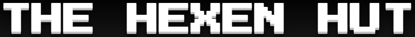

<h1 align="center">The Hexen Hut - Video Games and Esports Bar (MS1) </h1>

Responsive Mockup

[View the deployed website](https://nyxhexen.github.io/CI_MS1_THH/)

---

## Introduction

### __*The Bar*__
An all-inclusive community-oriented gaming bar in Cardiff, where people can use onsite equipment to play video games for free while enjoying drinks & food. Events are hosted regularly where customers are invited to participate in competitive video games events, along regular events such as hosting meet-ups, brand parties, product launches, etc.

---

## Table of Content
### 1. [Project Goals](#1-project-goals) 

### 2. [User Experience](#2-user-experience)
1. [Target Audience](#target-audience)
2. [User Stories](#user-stories)
3. [Scope](#scope)
4. [Design](#design)
5. [Wireframes](#wireframes)

### 3. [Features](#3-features)

### 4. [Technology](#4-technology)
1. [Languages](#languages)
2. [Frameworks & Tools](#frameworks-and-tools)

### 5. [Testing](#5-testing)
1. [HTML Validation](#HTML-validation)
2. [CSS Validation](#CSS-validation)
3. [Accessibility](#accessibility)
4. [Performance](#performance)
5. [Device testing](#performing-tests-on-various-devices)
6. [Browser compatibility](#browser-compatability)
7. [Testing user stories](#testing-user-stories)

### 6. [How-to DIY: GitHub Deploy, Fork, Clone](#6-how-to-diy-github-deploy-fork--clone)

### 7. [Credits](#7-credits)
1. [Code](#code)
2. [Media](#media)
3. [Acknowledgements](#acknowledgements)

---

## Project Goals
[`Back To Top`](#table-of-contents)

1. The goal of the web application is to increase brand awareness in order to promote it and it's events, increase sales, and grow the customer base further. 
2. Easy to understand sections with no walls of text.
3. Links & buttons invite the customer to explore further.
4. The website should elicit a positive response and make the customer excited to visit in person.

---

## 2. User Experience
[`Back To Top`](#table-of-contents)

The website has been designed as mobile-first, and has 3 general layout shifts for mobile, tablet, and desktop screens.

I wanted to keep the design minimalistic, and content to the point, but add extra functionality where possible to enhance the overal experience.

### **Target Audience**
The bar's primary demographic is people interested in video games and e-sports.

### **User Stories**
1. As a new customer I would like to learn about The Hexen Hut and what it is.
2. As a new customer I would like to know where the bar is located.
3. As a new/returning customer I would like to read about what other people's experience visiting the bar is.
4. As a new/returning customer I would like to see what food & drinks the bar offers.
5. As a new/returning customer I would like to find out more about the events held at the bar.
6. As a new/returning customer I would like to sign-up for an upcoming event.
7. As a new/returning customer I am looking to visit their social media accounts to stay updated.
8. As a new/returning customer I am looking to contact the bar with a question/suggestion.

### **Scope**

#### The scope of the project at release is defined as below:
- A full-screen landing page.
- Navigation links/bar to allow users to explore the website. Link/button highlighted when active.
- Footer with bar address, opening times and social links.
- Pop-up navigation bar for mobile and tablets.
- Menu page listing all food & drinks available for purchase.
- Interactive accordion listing available cocktails.
- Scroll section showing images from past bar events.
- List of upcoming and past events.
- A pop-up sign-up form, so customers can register to participate in events.
- Search bar (WIP) and a scroll section with frequently asked questions and answers.
- A feedback form for customers to message the bar.
- About page showing bar features and a customer comment section.

---

## Design

My idea for the design was to create something that resembled video games in the 80's while keeping the styling smooth, with a 3D feel.

### **Color Scheme**
Initially, primary and accent were swapped, but after applying some of the styling I decided the green is better suited as primary.

Primary Color: #9dff00

Accent Color: #7738ff

Container Color: #7738ff

Background Color: **#222**

### **Typography**
The **fallback font** chosen across the website is 'sans-serif' for it's accessibility.

My **logo and h1-h3 headings** font is Press Start 2P from Google Fonts. I chose this font because it is an 8-bit style, bulky, font which fit into the thematic of the bar.

My **h4+ headings and body** font is Play, also from Google Fonts. The font is more angular which compliments the 8-bit style font.

### **Images**
Images on the website have been sourced through Google Images search and, where available, are licensed for non-commercial use.

 Carousel Images 

Source: [Belong Arena UK - Twitter](https://twitter.com/BelongKingston/status/1521460056620941313/photo/1)

Source: [Unsplash - Florian Olivo](https://unsplash.com/photos/Mf23RF8xArY)

Source: [Unsplash - Ella Don](https://unsplash.com/photos/GVbd5btrqeA)

Source: [Unsplash - Ella Don](https://unsplash.com/photos/K4kfIEhj4GM)

Source: [Unsplash - Stem List](https://unsplash.com/photos/EVgsAbL51Rk)

---

## **Wireframes**

|Mobile Wireframes 
|-------------------
|

1. Landing Page

|

2. Menu

|

3. Events

|

4. FAQ

|

5. About Us

|Tablet Wireframes 
|-------------------
|

1. Landing Page

|

2. Menu

|

3. Events

|

4. FAQ

|

5. About Us

|Desktop Wireframes 
|-------------------
|

1. Landing Page

|

2. Menu

|

3. Events

|

4. FAQ

|

5. About Us

---

## 3. Features
[`Back To Top`](#table-of-contents)

---

## 4. Technology
[`Back To Top`](#table-of-contents)

|Technology | Specification |
|---|---|
|Operating System | Windows 10 x64|
|IDE | Visual Studio Code |
|Version Control| Git |
|Deployment | GitHub Pages |
|Languages | HTML5 & CSS3 |
|Font - Logo & Main Menu Buttons | [Google Fonts - "Press Start 2P"](https://fonts.google.com/specimen/Press+Start+2P)|
|Font - Headers & Other Buttons | [Google Fonts - "Play"](https://fonts.google.com/specimen/Play) |
|Font - Fallback | sans-serif |
|Responsive Mockup | https://ui.dev/amiresponsive |
|Image Converter | https://www.freeconvert.com/png-to-webp |

---

## 5. Testing
[`Back To Top`](#table-of-contents)

### HTML Validation 
[W3C Markup Validation Service](https://validator.w3.org/) was used to validate the HTML of the website. All pages pass with 0 errors and 0 warnings. 

Landing Page (index.html)

Our Menu (our-menu.html)

Events (events.html)

FAQ (faq.html)

About Us (about.html)

### CSS Validation
[W3C CSS Validation Service](https://jigsaw.w3.org/css-validator/) was used to validate the CSS of the website.

Both CSS passed with 0 errors, and warnings relating only to variables.

style-main.css (index.html specific)

style.css

### Accessibility
[WAVE WebAIM Web Accessibility (Chrome Plugin)](https://chrome.google.com/webstore/detail/wave-evaluation-tool/jbbplnpkjmmeebjpijfedlgcdilocofh) was used to check that the code meets accessibility standards. 

Menu, Events and FAQ pages pass with 0 errors and 0 warnings.

Landing page has 4 alerts for "device dependent event handler" (onclick). As the button consists of a styled div with an anchor child I wanted to make sure the div acts as a button, where the onclick property came in handy.

About page has 3 alerts for "Possible heading" due to content length. Alerts pertain to the use of `
` element as text container for the Comments section author found under the white bubble.

---

## 6. How-to DIY: GitHub Deploy, Fork & Clone
[`Back To Top`](#table-of-contents)

--- 

## 7. Credits
[`Back To Top`](#table-of-contents)
1. [Meltdown](https://www.meltdown.bar) bar - London, UK - text content used in [About Us]() & [Events]() pages .

