<h1 align="center">The Hexen Hut - Video Games and Esports Bar (MS1) </h1>

[View the deployed website](https://nyxhexen.github.io/CI_MS1_THH/)

---

## Introduction

### __*The Bar*__
An all-inclusive community-oriented gaming bar, where people can use onsite equipment to play video games for free while enjoying drinks & food. Events are hosted regularly where customers are invited to participate in competitive video games events, along regular events such as hosting meet-ups, brand parties, product launches, etc.

---

## Table of Contents
### 1. [Project Goals](#1-project-goals-1) 

### 2. [User Experience](#2-user-experience-1)
1. [Target Audience](#target-audience)
2. [User Stories](#user-stories)
3. [Scope](#scope)
4. [Design](#design)
5. [Wireframes](#wireframes)

### 3. [Features](#3-features-1)

### 4. [Technology](#4-technology-1)

### 5. [Testing](#5-testing-1)
1. [HTML Validation](#html-validation)
2. [CSS Validation](#css-validation)
3. [Accessibility](#accessibility)
4. [Performance](#performance)
5. [Browser Compatibility](#browser-compatibility)
6. [Device Testing](#devices-tested-on)
7. [Testing User Stories](#testing-user-stories)

### 6. [Bug/Fix Log](#6-bugfix-log-1)

### 7. [How-to DIY: GitHub Deploy, Fork, Clone](#7-how-to-diy-github-deploy-fork--clone)

### 8. [Credits](#8-credits-1)
1. [Code](#code)
2. [Media](#media)
3. [Acknowledgements](#acknowledgements)

---

## 1. Project Goals
[`Back To Top`](#table-of-contents)

### User Goals:
- Find a video games/esports bar with a good atmosphere;
- View bar's menu & prices;
- Find the bar's location;
- Find out what the bar offers;

### Site Owner Goals:
- Increase brand awareness;
- Increase sales;
- Promote bar events;
- Grow customer base;
- Receive feedback;
- Provide customers with a way to contact us.

---

## 2. User Experience
[`Back To Top`](#table-of-contents)

The website has been designed as mobile-first, and has 3 general layout shifts for mobile, tablet, and desktop screens.

I wanted to keep the design minimal and content to the point, but add extra functionality where possible to enhance the overall experience.

### Target Audience

- People interested in video games or esports;
- People looking for a cocktail bar;
- People looking for bar that offers food;
- People who want to take part in events;

### User Requirements:

- Fully responsive website;
- Visually appealing and relevant content;
- Bite-sized information;
- Fully functioning links and buttons;
- Accessibility;
- Easy way to contact the venue;

### User Stories

#### New Customers
1. As a new customer, I want to know what The Hexen Hut is.
2. As a new customer, I want to know what to expect at the bar.
3. As a new customer, I want to know the bar's address.
4. As a new customer, I want to know what the price range is.
5. As a new customer, I want to get directions to the bar.
6. As a new customer, I want to know the operating hours.

#### Returning Customers
7. As a returning customer, I want to view comments or reviews left by previous visitors.
8. As a returning customer, I want to see the menu.
9. As a returning customer, I want to contact the bar via phone.
10. As a returning customer, I want to leave feedback, comment or suggestion to the bar.
11. As a returning customer, I want to find the bar on social media.
12. As a returning customer, I want to view upcoming events.
13. As a returning customer, I want to view previous/past events.
14. As a returning customer, I want to sign up for an event.
15. As a returning customer, I want to view photos from/of the bar.
16. As a returning customer, I want to view frequently asked questions.

#### Site Owner

17. As a site owner, I don't want users to use browser's navigation buttons while using the website.
18. As a site owner, I want users to be able to get to know the bar.
19. As a site owner, I want users to be able to contact us.
20. As a site owner, I want users to be able to provide feedback.

### Scope

#### The scope of the project at release is defined as below:
- A full-screen landing page.
- Navigation links/bar to allow users to explore the website. Link/button highlighted when active.
- Footer with bar address, opening times and social links.
- Pop-up navigation bar for mobile and tablets.
- Menu page listing all food & drinks available for purchase.
- Interactive accordion listing available cocktails.
- Scroll section showing images from past bar events.
- List of upcoming and past events.
- A pop-up sign-up form, so customers can register to participate in events.
- Search bar (WIP) and a scroll section with frequently asked questions and answers.
- A feedback form for customers to message the bar.
- About page showing bar features and a customer comment section.

### Design

My idea for the design was to create a simple, clean website with an 8-bit feel. Think Square Enix does Minecraft.

#### Color Scheme

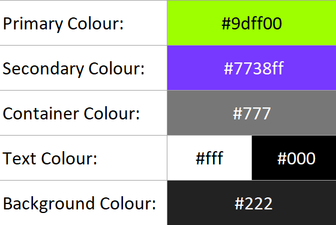

#### Typography
The **fallback font** chosen across the website is 'sans-serif' for it's accessibility.

My **logo and h1-h3 headings** font is Press Start 2P from Google Fonts. I chose this font because it is an 8-bit style, bulky, font which fit into the theme of the bar.

My **h4+ headings and body** font is Play, also from Google Fonts. The font is more angular which compliments the 8-bit style font.

#### Images
Images across the website are sourced through Unsplash and a couple of Google searches. The sources have been listed below.

 Carousel Images 

Source: [Belong Arena UK - Twitter](https://twitter.com/BelongKingston/status/1521460056620941313/photo/1)
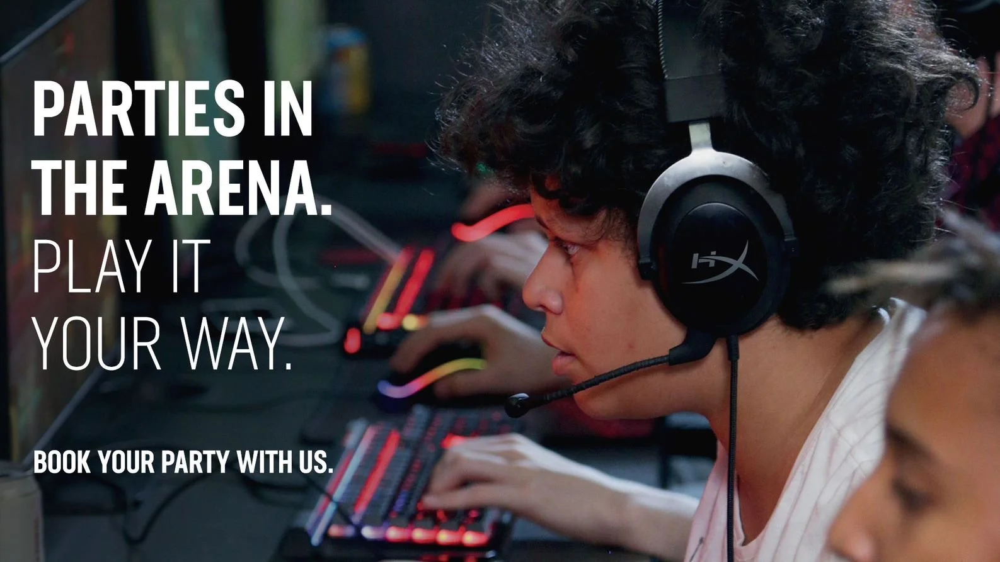

Source: [Unsplash - Florian Olivo](https://unsplash.com/photos/Mf23RF8xArY)

Source: [Unsplash - Ella Don](https://unsplash.com/photos/GVbd5btrqeA)

Source: [Unsplash - Ella Don](https://unsplash.com/photos/K4kfIEhj4GM)

Source: [Unsplash - Stem List](https://unsplash.com/photos/EVgsAbL51Rk)

 Comment Section 

Source: [Commander Shepard Artwork - Escapist Magazine](https://www.escapistmagazine.com/bioware-appeals-for-calm-regarding-mass-effect-3-multiplayer/)

Source: [GLaDOS Artwork - Tumblr/enealae](https://enealae.tumblr.com/post/19831917186)

Source: ['I like trains' Artwork - DeviantArt/belen02](https://www.deviantart.com/belen02/art/I-like-trains-422588773)
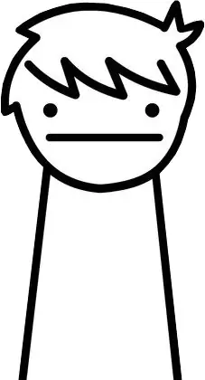

---

### Wireframes

|Mobile Wireframes 
|-------------------
|

1. Landing Page

|

2. Menu
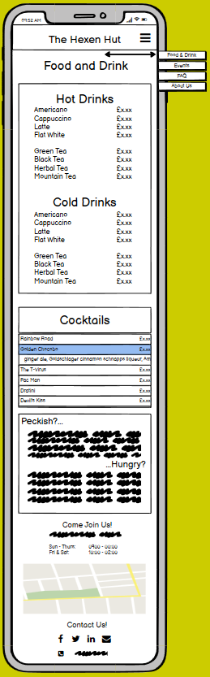

|

3. Events

|

4. FAQ

|

5. About Us

|Tablet Wireframes 
|-------------------
|

1. Landing Page
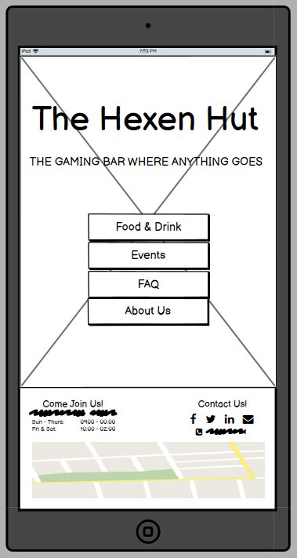

|

2. Menu
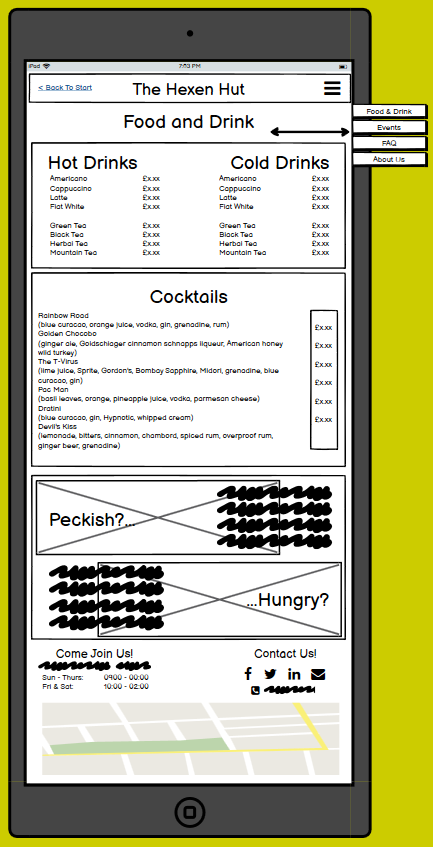

|

3. Events

|

4. FAQ

|

5. About Us

|Desktop Wireframes 
|-------------------
|

1. Landing Page

|

2. Menu

|

3. Events

|

4. FAQ

|

5. About Us

---

## 3. Features
[`Back To Top`](#table-of-contents)

The website consists of 5 responsive pages with 2 to 3 features per page.

Each page has 2 to 3 layout shifts across the 3 types of devices.

### Features at release

### index.html - Landing Page

Landing page has it's own separate stylesheet as the page consists of only header and footer elements. While footer remains the same across all devices, I wanted to house this header style separate from the rest.

I kept the landing page as simple and as clean as possible, so the customer gets a feel for what the website is about. This is the only page where the slogan can be found as it's one of only 3 things the customer sees upon visiting and it describes what the venue is about. A gaming bar.

The landing page consists of 2 main features:

 1. Full screen header 

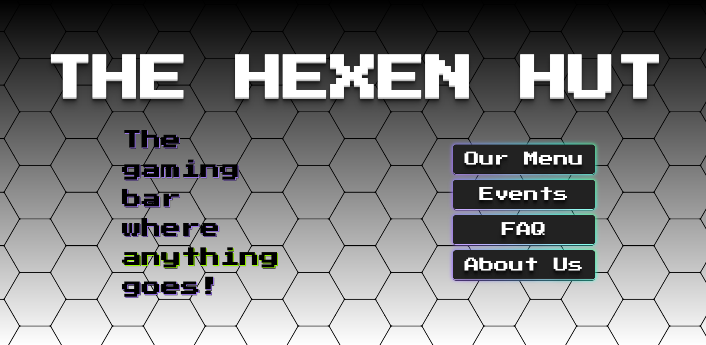

 2. Footer 

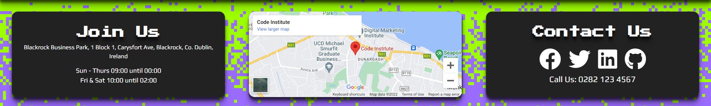

The full screen header consists of 3 sections:
1. Logo - I wanted to keep things simple, so the logo is made up of an anchor (to allow use as navigation button) within an h1 element. The `h1` allowed the logo to also naturally respond to any view width changes. The logo has an infinite bounce keyframe animation inspired by the behavior of the game title in some video games. 

 Supporting Image 

2. Slogan - A standard `h2`, describing the bar's theme and purpose. It took a bit of time to style it the way it looks now. I wanted it to stand out, which is why I chose the color black for the text, but that created some issue with readability and contrast which I resolved by adding two layers of shadow in different color.

_User Story Covered: 1_

 Supporting Image 

3. Navigation buttons - This was the first major style that I got to enjoy customizing. I changed pretty much all styling of the button to make it fit my design, but kept the structure somewhat close to the original. The structure of each button is `ul > li > div > a` and utilizes both pseudo elements of the `li`. 

 Supporting Image 

- Background image - Background image is a pattern png with no background color, rotated 45 degrees, which has keyframe moving it on both X and Y axes. The background image is contained within it's own `div`, within the header, and is applied using CSS `background-image: url()`. It took a bit of fine tuning to figure out the best speed for the animation, as the original speed was a bit nausea inducing combined with the bounce of the logo and buttons.

 Supporting Image 

The footer remains the same across all pages, including any layout shifts.

It consists of 4 sections:
1. 'Join Us' section which lists the physical location and operating hours of the venue.

 Supporting Image 

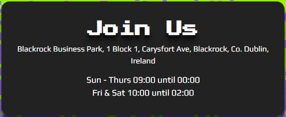

_User Story Covered: 3, 6_

2. A Google Maps iframe with a pin and the venue name.

 Supporting Image 

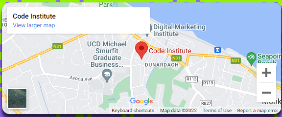

_User Story Covered: 5_

3. 'Contact Us' section which holds the venue's social links and phone number. All links open in a new window and activating the phone number redirects to the mobile phone's dial pad.

 Supporting Image 

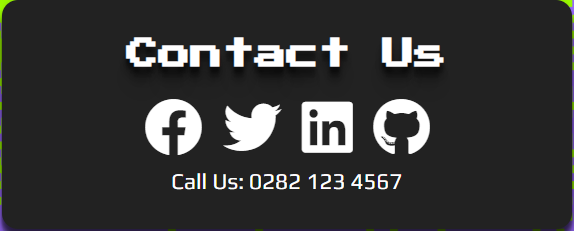

_User Story Covered: 9, 11, 19_

- Background image which has been applied using CSS, the same way as the header background.

 Supporting Image 

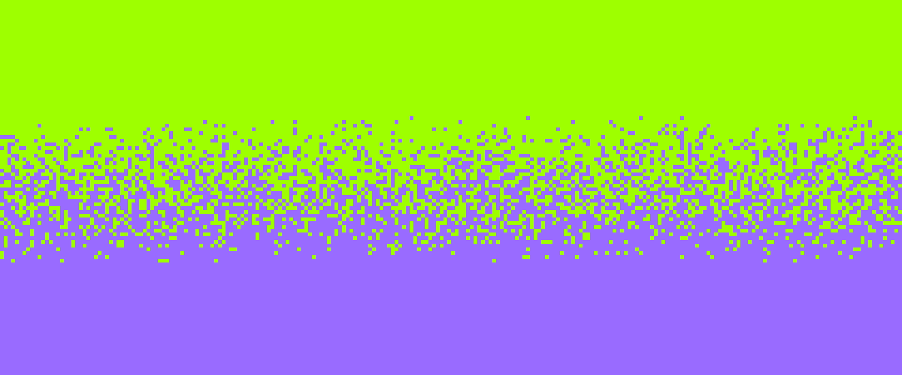

### Header - All pages (excl index.html)

The header of the remaining pages (our-menu, events, faq, and about) is different to the header seen on the landing page.

This header is made up of 3 features:
1. Logo - uses the same design as on Landing page. On click redirects to Landing page.

 Supporting Image 

2. Back button - Initially this was just an anchor which when activated took you to the landing page. After getting some feedback from other students and doing some research I decided to transform it into a button and add an onclick event (`onclick="history.back()`) which gave it the functionality of a browser back button.
- Structured as `button > i + span`. The span allowed me to hide the text on smaller screens.

_User Story Covered: 17_

 Supporting Image 

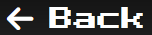

3. Navigation links:

- On large screens, the navigation links are organized horizontally with the active element highlighted.

 Supporting Image 

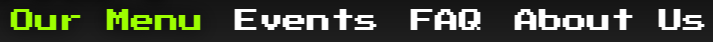

- On mobile and tablets, the navigation links list is hidden and replaced by a burger button which controls the state of the nav list. The expand/collapse function was done with JavaScript event listener which adds a new class to the body when the button is pressed.

 Supporting Image 

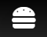
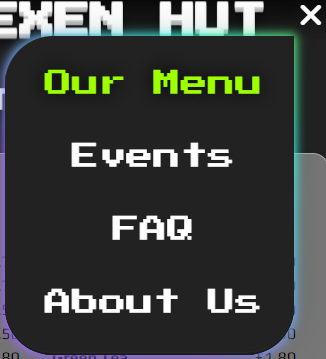

### our-menu.html - Our Menu

Our Menu page is made up of 2 features.
1. Drinks menu, consists of 4 sections of which only 3 are visible at one given time. 
    1. Cold drinks and Hot drinks - visible at all times and are made of `ul > li`, with `span` used to contain the prices, which helped with creating the layout.
    2. Cocktail drinks - has two versions, only one of which is visible depending on the device screen size. 
        - Version A is an accordion, available only on mobile and tablets, made using radio inputs and their :checked state which shows or hides the ingredients of the selected item. This helped make the cocktail menu a lot smaller, eliminating the need to scroll through a long list, and generally easier to digest on smaller devices. As this is a less accessible than an unordered list I decided to hide it from screen readers using `aria-hidden="true"`.
        - Version B is an unordered list made to look like a table. The structure of this version is `ul > li > h4 + 2*span`. 

 Supporting Image 

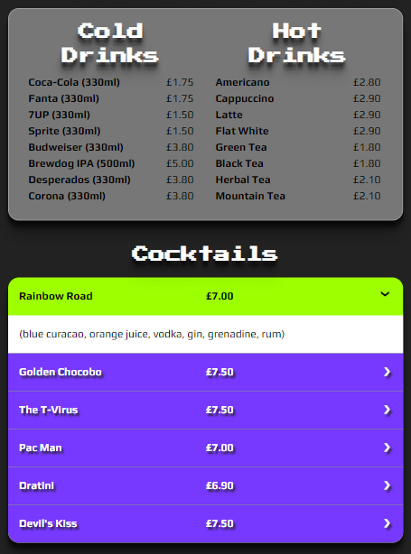
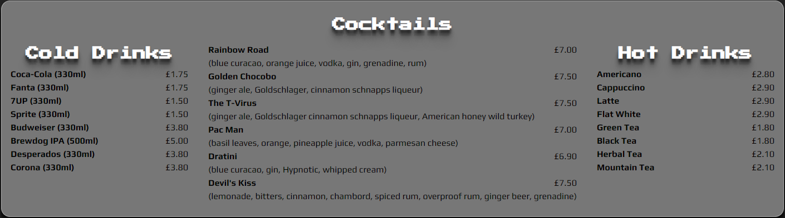

_User Story Covered: 4, 8_

2. Food menu, consists of 2 sections - snacks ("Peckish?...") and meals ("...Hungry?").

 Supporting Image 

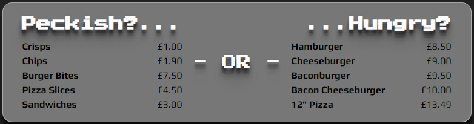

_User Story Covered: 4, 8_

### events.html - Events

Events page is made up of 3 features.
1. Carousel -  consisting of 5 images intended to promote the events at the bar. To make it so the images can be focused `tabindex="0"` was added to each img container.
    - On desktop, the images are spread across the view width.
    - On mobile and tablet, utilizes `flex-shrink: 1` which forces the images to fit to the container width, creating an overflow on the X axis, which we then use to our advantage by adding `overflow-x: scroll`, allowing us to scroll through that overflow.
    

 Supporting Image 

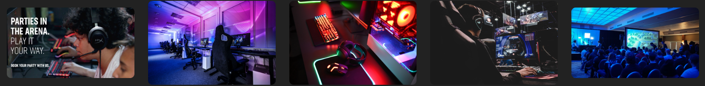
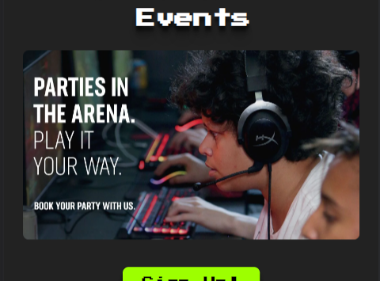

_User Story Covered: 2, 15_

2. Sign Up form - consists of a trigger button and a form with multiple inputs, the form's visibility is controlled the same as the mobile nav burger menu. This was fairly challenging as I had no point of reference, so I had to logic my way into making the form behave the way I had envisioned. Possibly my favorite feature on the website. 

 Supporting Image 

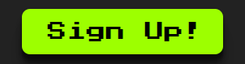

_User Story Covered: 14_

3. Event lists - two unordered lists, styled identically. The dark background of each item was added to improve contrast/accessibility and make it stand out. The list items have a :hover style to make them look like links.

 Supporting Image 

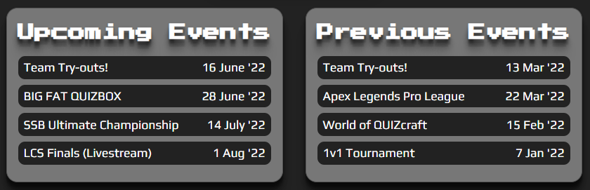

_User Story Covered: 12, 13_

### faq.html - FAQ

FAQ page consists of 2 features.
1. Frequently Asked Questions search and scroll - consists of two parts.
- Search:
    - a search input field, which currently does not have functionality much different to a text input element.
    - a search button, visually nested within the search input field.

 Supporting Image 

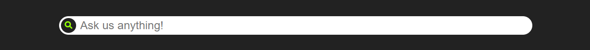

- Scroll box with questions and answers - used the same method to create the scroll behavior as the image carousel on Events page, with customized scroll bar to match the website theme. It was with this feature that I learned of the existence of `scroll-padding`, which helped me control the exact position the scroll snapped to, so the bottom of the previous div is always visible. `tabindex="0"` was also added to each container to make each FAQ entry in the scroll box focusable.

 Supporting Image 

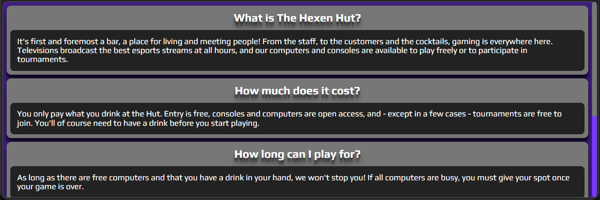

_User Story Covered: 1, 2, 16, 18_

2. Feedback Form - a standard form with a custom appearance. I reset the radio element appearance using `appearance: none` and then rebuilt them from scratch in order to give them the appearance resembling LED lights of a computer.

 Supporting Image 

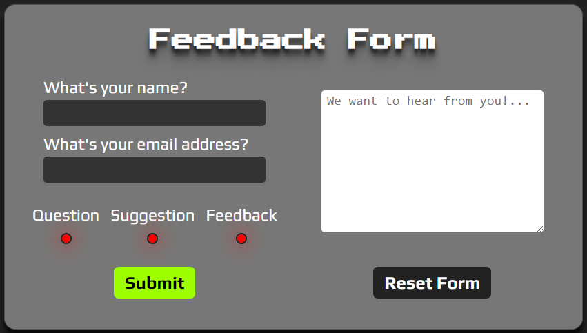

_User Story Covered: 10, 20_

### about.html - About Us

About Us page consists of 2 features:
1. Bar Perks - a section outlining the perks of visiting the bar. This feature has 3 layout shifts for each device. This was also the point at which I researched direct text manipulation a bit deeper and found `writing-mode` (more widely used in Eastern countries such as Japan, where text is written top-to-bottom, left-to-right), which helped me with fitting everything on smaller devices. The dark gradient was added to make the section stand out and improve text visibility.

 Supporting Image 

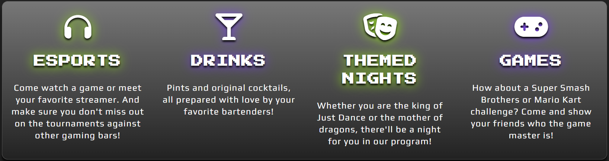

_User Story Covered: 1, 2, 18_

2. Comment Section - this section shows comments left by previous customers of the bar. Each comment consists of a heading, containing the comment, and a paragraph element housing the comment author.

 Supporting Image 

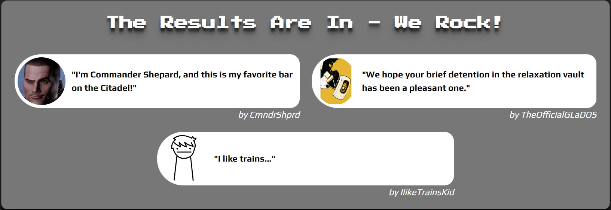

_User Story Covered: 7_

### 404.html

Custom 404 Page Not Found error page gives helpful instructions to the customer should they find themselves on a broken link/missing page.

The button on the page takes the user to the landing page (index.html), or they can use the back button and/or navigation links to get back.

 Supporting Image 

_User Story Covered: 17_

---

## 4. Technology
[`Back To Top`](#table-of-contents)

|Technology | Specification |
|---|---|
|Operating System | Windows 10 x64|
|IDE | Visual Studio Code |
|Version Control| Git |
|Deployment | GitHub Pages |
|Languages | HTML5 & CSS3 (& a tiny bit of JS) |
|Font - Logo & Main Menu Buttons | [Google Fonts - "Press Start 2P"](https://fonts.google.com/specimen/Press+Start+2P)|
|Font - Headers & Other Buttons | [Google Fonts - "Play"](https://fonts.google.com/specimen/Play) |
|Font - Fallback | sans-serif |
|Responsive Mockup | https://ui.dev/amiresponsive |
|Image Converter | https://www.freeconvert.com/png-to-webp |

---

## 5. Testing
[`Back To Top`](#table-of-contents)

### HTML Validation 

[W3C Markup Validation Service](https://validator.w3.org/) was used to validate the HTML of the website. All pages pass with 0 errors and 0 warnings. 

Landing Page (index.html)

Our Menu (our-menu.html)

 

Events (events.html)

FAQ (faq.html)

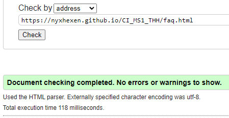

About Us (about.html)

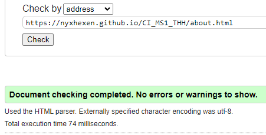

Custom 404 page (404.html)

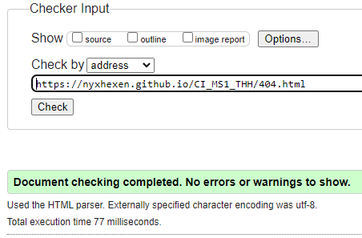

### CSS Validation

[W3C CSS Validation Service](https://jigsaw.w3.org/css-validator/) was used to validate the CSS of the website.

CSS passed with 0 errors, and a couple of warnings relating to variables.

style-main.css

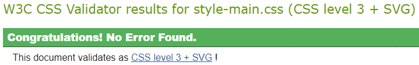

style.css

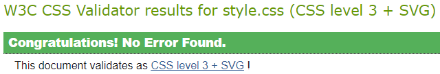

### Accessibility

[WAVE WebAIM Web Accessibility (Chrome Plugin)](https://chrome.google.com/webstore/detail/wave-evaluation-tool/jbbplnpkjmmeebjpijfedlgcdilocofh) was used to check that the code meets accessibility standards. 

Menu, Events and FAQ pages pass with 0 errors and 0 warnings.

Landing page has 4 alerts for "device dependent event handler" (onclick). As the button consists of a styled `li` with an anchor descendant I wanted to make sure the styled element acts as a button, which is where the onclick property came in handy.

About Us page has 3 alerts for "Possible heading" due to content length. Alerts pertain to the use of `
` element as text container for the comments section author found under the white bubble.

Landing Page (index.html)

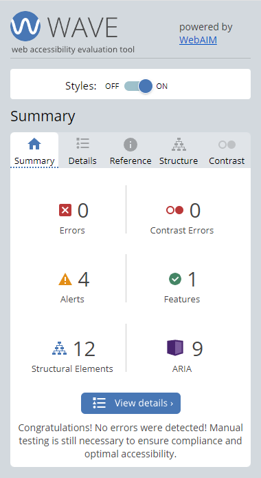

Our Menu (our-menu.html)

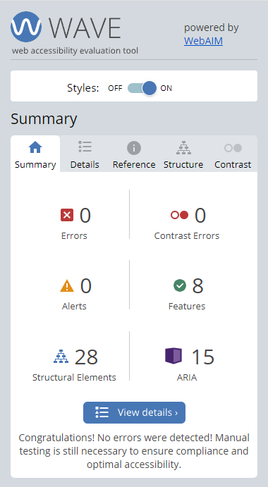

Events (events.html)

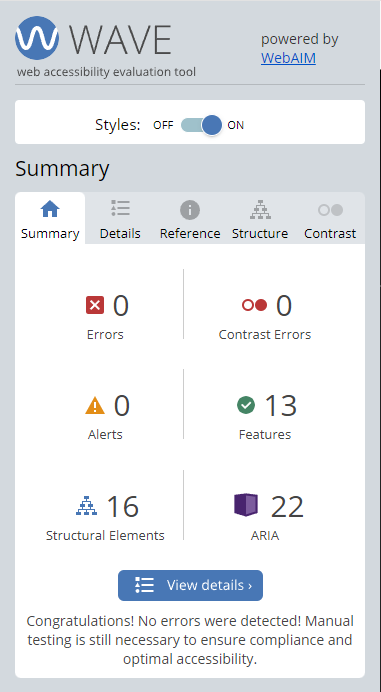

FAQ (faq.html)

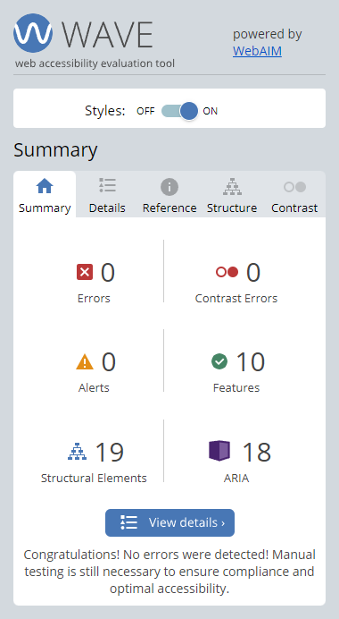

About Us (about.html)

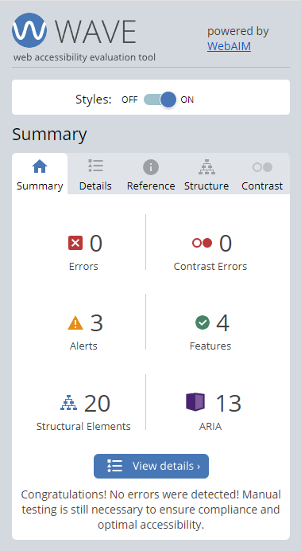

Custom 404 (404.html)

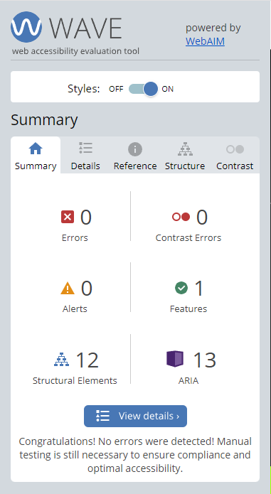

### Performance

[Google Lighthouse](https://developer.chrome.com/docs/lighthouse/overview/) was used to measure the website's speed and performance. 

Landing Page (index.html)

Our Menu (our-menu.html)

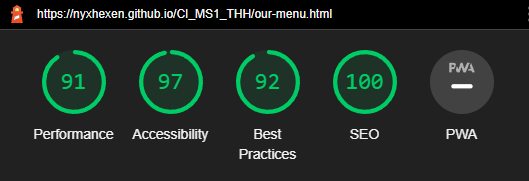

Events (events.html)

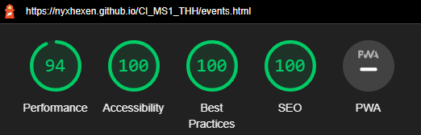

FAQ (faq.html)

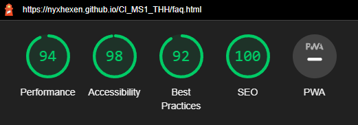

About Us (about.html)

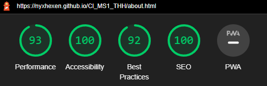

Custom 404 (404.html)

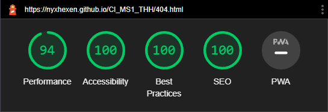

### Browser compatibility:

- Microsoft Edge: Functionality and style as expected.
- Google Chrome: Functionality and style as expected.
- Firefox: Functionality as expected.
    - Style difference in scroll bar appearance from the other browsers due to the fact Firefox utilizes JavaScript to change the appearance instead.
- Opera/Opera GX: Functionality and style  as expected.
- Safari: Functionality and style  as expected. (Thank you, Kera!)

### Devices tested on:

- Tower desktop with 27" monitor;
- OnePlus 9 Pro.

### Test Performed

1. Website layout is as intended; no style errors. 
2. Logo redirects users back to landing page.
3. Pages are responsive in mobile view and no content is cut off/misaligned.
4. All text is easy to read.
5. Navigation links direct users to correct page; there are no broken links. 
6. Collapsed nav bar presence; opens and closes with no issues. 
7. Telephone anchor correctly redirects mobile users to Dial Pad. 
8. Google API functional and responsive. 
9. Images load with no broken links.
10. Carousel slides with no issues.
11. Sign-up form pop up and button functional and correct sizing.
12. Forms do not submit until all fields are complete.
13. Custom 404 page functions as intended.

Results:
- Testing on devices passes all tests.

### Testing User Stories

1. As a new customer, I want to know what The Hexen Hut is.

| Feature | Action | Expected Result | Actual Result
|--- |--- |--- |---
| Slogan | Navigate to landing page by clicking on the logo from any page | Customer's question is answered by slogan on landing page | As expected
| Perks | Navigate to About us page | Customer locates perks section | As expected
| FAQ | Navigate to FAQ page | Customer is able to scroll through and read FAQs | As expected
 

 Supporting Images 

- Slogan
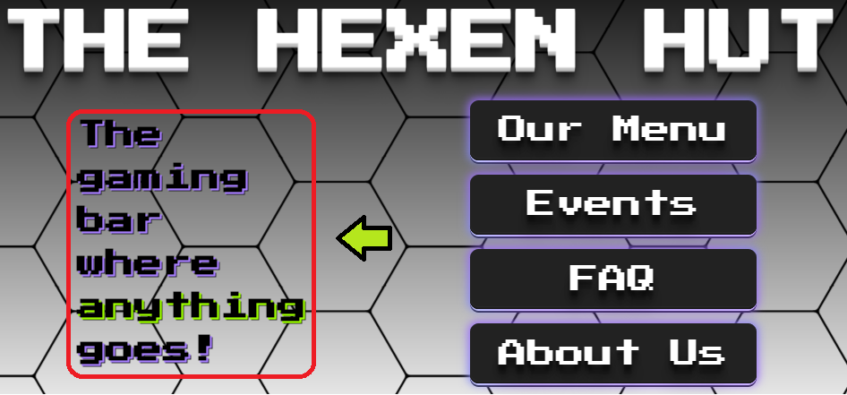

- Perks
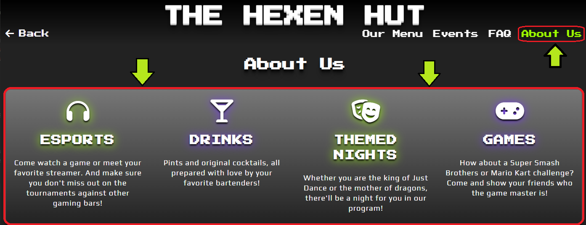

- FAQ
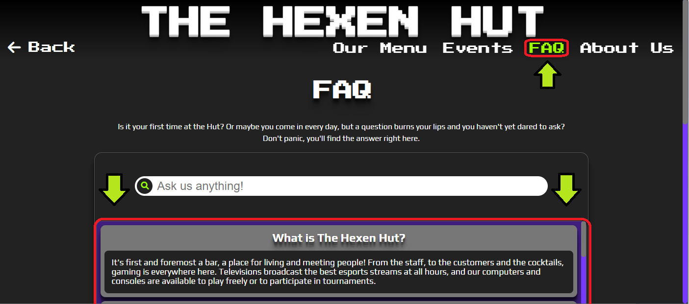

2. As a new customer, I want to know what to expect at the bar.

| Feature | Action | Expected Result | Actual Result
|--- |--- |--- |---
| Events - Images Carousel | Navigate to Events page | Customer is able to locate and view pictures | As expected
| FAQ - FAQ Scroll Box | Navigate to FAQ page | Customer is able to scroll through and read FAQs | As expected
| About Us - Perks Section | Navigate to About us page | Customer locates perks section | As expected

 Supporting Images 

- Events - Images Carousel
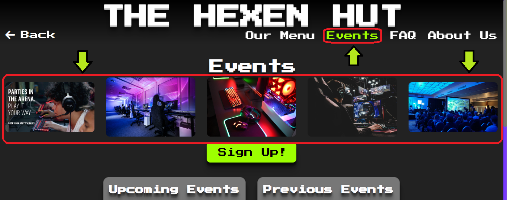

- FAQ - FAQ Scroll Box
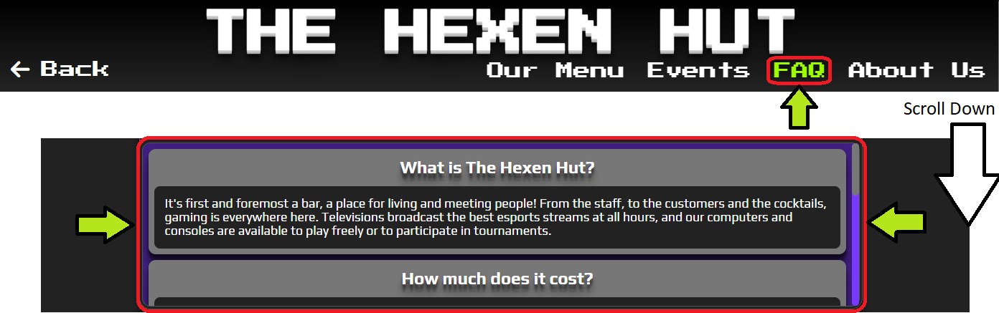

- About Us - Perks Section

3. As a new customer, I want to know the bar's address.

| Feature | Action | Expected Result | Actual Result
|--- |--- |--- |---
| Footer - Join Us Section | Scroll to the bottom of any of the site's pages | Locate Join Us section and address | As expected

 Supporting Images 

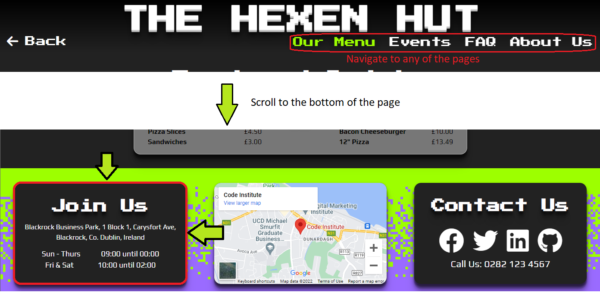

4. As a new customer, I want to know what the price range is.

| Feature | Action | Expected Result | Actual Result
|--- |--- |--- |---
| Our Menu Page | Navigate to Our Menu page | Customer views the menu | As expected

 Supporting Images 

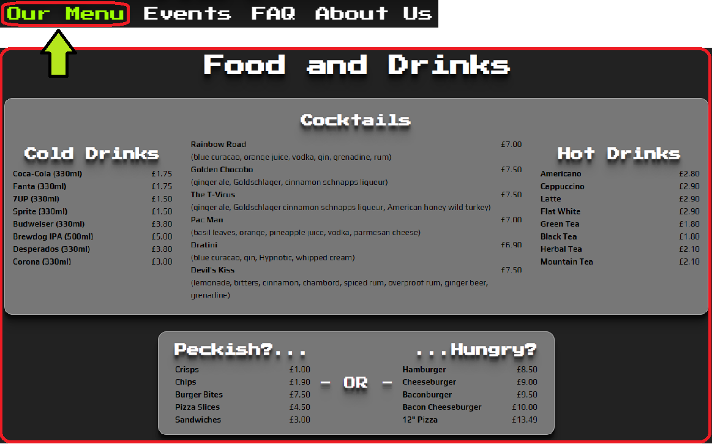

5. As a new customer, I want to get directions to the bar.

| Feature | Action | Expected Result | Actual Result
|--- |--- |--- |---
| Footer - Embedded Google Map | Scroll to the bottom of any of the site's pages | Locate embedded Google map, click 'View Larger Map'  | As expected

 Supporting Images 

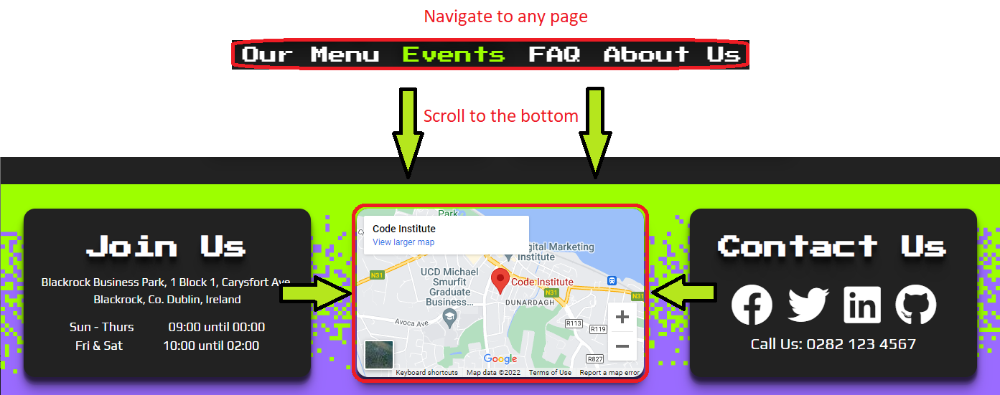

6. As a new customer, I want to know the operating hours.

| Feature | Action | Expected Result | Actual Result
|--- |--- |--- |---
| Footer - Join Us Section | Scroll to the bottom of any of the site's pages | Locate Join Us section and operating hours | As expected

 Supporting Images 

7. As a returning customer, I want to view comments or reviews left by previous visitors.

| Feature | Action | Expected Result | Actual Result
|--- |--- |--- |---
| About Us - Comment Section | Navigate to About Us page and scroll down | Customer is able to locate comments section | As expected

 Supporting Images 

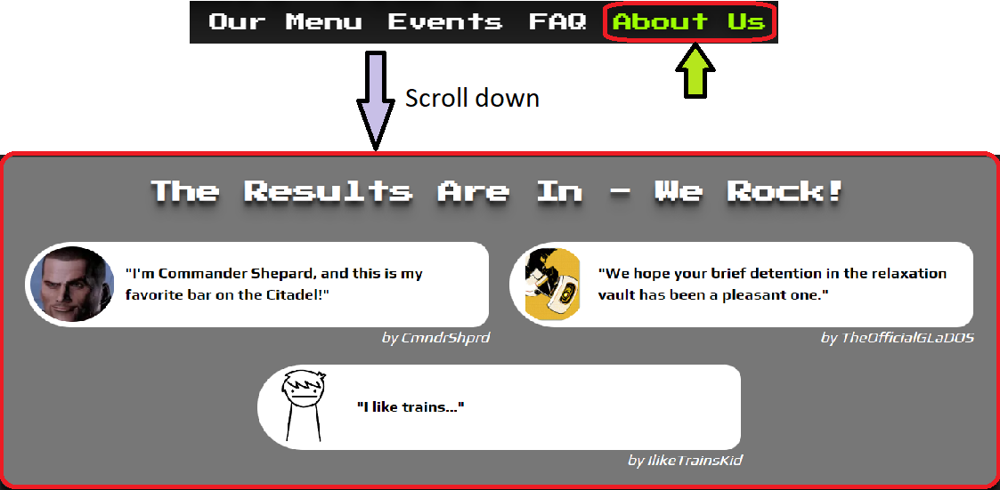

8. As a returning customer, I want to see the menu.

| Feature | Action | Expected Result | Actual Result
|--- |--- |--- |---
| Our Menu page | Navigate to Our Menu page | Customer views the menu | As expected

 Supporting Images 

9. As a returning customer, I want to contact the bar via phone.

| Feature | Action | Expected Result | Actual Result
|--- |--- |--- |---
| Footer - Contact Us Section | Scroll to the bottom of any of the site's pages | Customer locates Contact Us section and is able to dial by clicking on number | As expected

 Supporting Images 

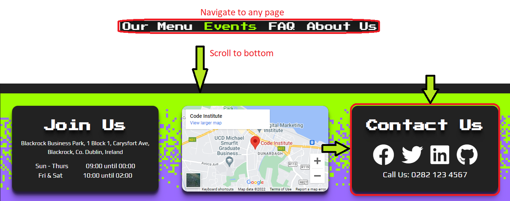

10. As a returning customer, I want to leave feedback, comment or suggestion to the bar.

| Feature | Action | Expected Result | Actual Result
|--- |--- |--- |---
| FAQ - Feedback Form | Navigate to FAQ page, scroll down | Customer is able to find and use the form | As expected

 Supporting Images 

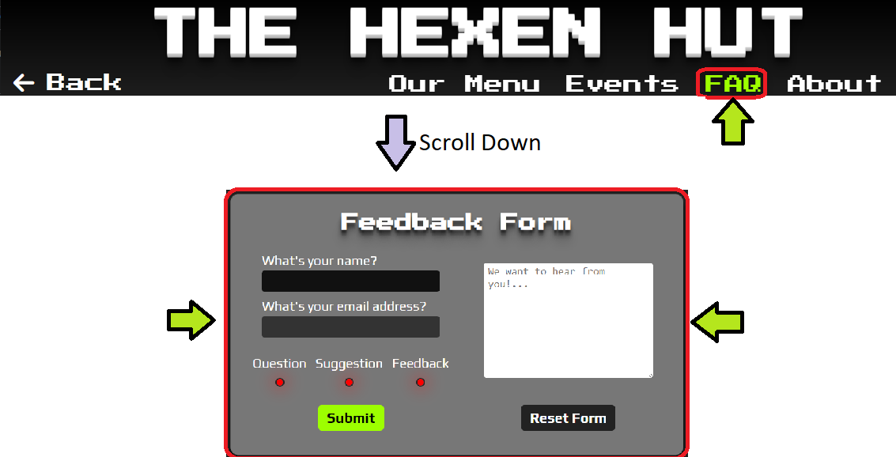

11. As a returning customer, I want to find the bar on social media.

| Feature | Action | Expected Result | Actual Result
|--- |--- |--- |---
| Footer - Contact Us Section | Scroll to the bottom of any of the site's pages | Customer locates social media links, they all open in new tabs | As expected

 Supporting Images 

12. As a returning customer, I want to view upcoming events.

| Feature | Action | Expected Result | Actual Result
|--- |--- |--- |---
| Events Page - Upcoming Events Section | Navigate to Events page (and scroll down) | Customer locates Upcoming Events section | As expected

 Supporting Images 

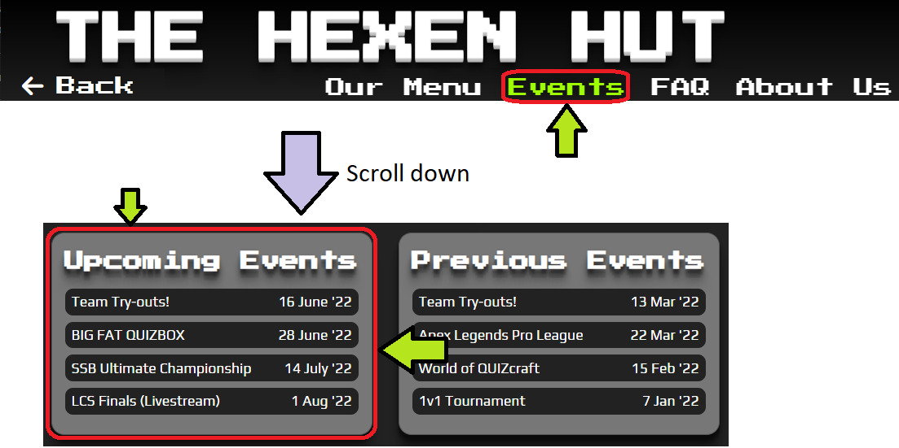

13. As a returning customer, I want to view previous/past events.

| Feature | Action | Expected Result | Actual Result
|--- |--- |--- |---
| Events Page - Previous Events Section | Navigate to Events page (and scroll down) | Customer locates Previous Events section | As expected

 Supporting Images 

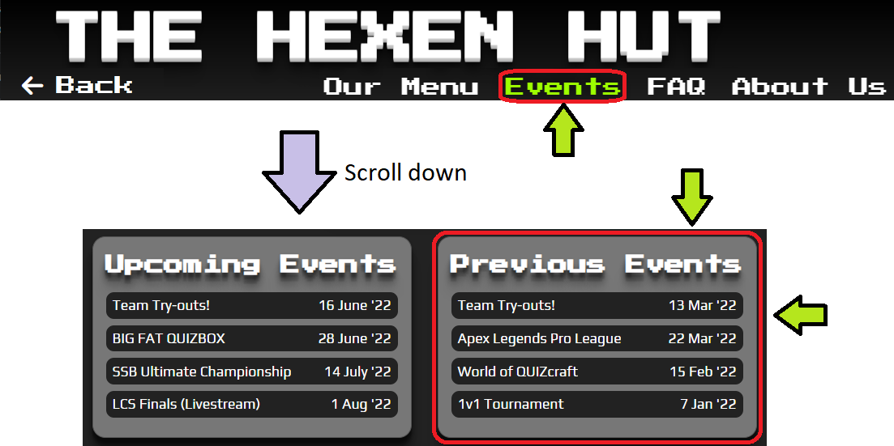

14. As a returning customer, I want to sign up for an event.

| Feature | Action | Expected Result | Actual Result
|--- |--- |--- |---
| Events Page - Sign Up Form | Navigate to Events page, click on 'Sign Up!' button to expand form | Customer is able to register for an event | As expected

 Supporting Images 

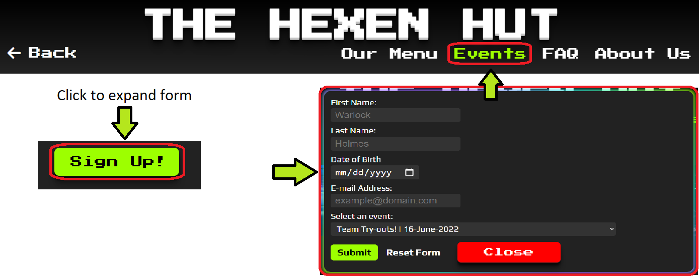

15. As a returning customer, I want to view photos from/of the bar.

| Feature | Action | Expected Result | Actual Result
|--- |--- |--- |---
| Events - Images carousel | Navigate to Events page | Customer is able to locate and view pictures | As expected

 Supporting Images 

16. As a returning customer, I want to view frequently asked questions.

| Feature | Action | Expected Result | Actual Result
|--- |--- |--- |---
| FAQ - FAQ Scroll Box | Navigate to FAQ page | Customer is able to scroll through and read FAQs | As expected

 Supporting Images 

17. As a site owner, I don't want users to use browser's navigation buttons while using the website.

| Feature | Action | Expected Result | Actual Result
|--- |--- |--- |---
| Header - Back Button | Locate and click back button to go to previous page | Customer has no difficulties finding the button; Back button takes the customer exactly 1 page back | As expected
| Custom 404 Error Page | Navigate back to the website by using the Back Button, Navigation Links, Logo, or the button within the notification window on the page | Customer is able to navigate back to the website | As expected

 Supporting Images 

- Header - Back Button
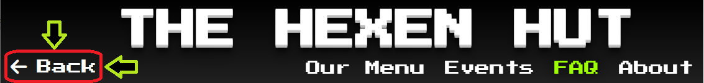

- Custom 404 Error Page
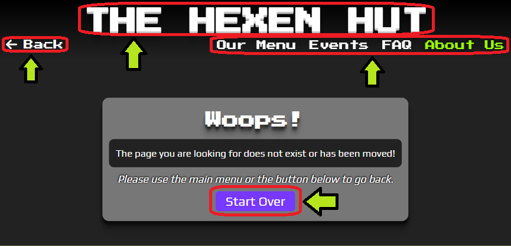

18. As a site owner, I want users to be able to get to know the bar.

| Feature | Action | Expected Result | Actual Result
|--- |--- |--- |---
| FAQ - FAQ Scroll Box | Navigate to FAQ page | Customer is able to scroll through and read FAQs | As expected
| About Us - Perks Section | Navigate to About us page | Customer locates perks section | As expected

 Supporting Images 

- FAQ - FAQ Scroll Box

- About Us - Perks Section

19. As a site owner, I want users to be able to contact us.

| Feature | Action | Expected Result | Actual Result
|--- |--- |--- |---
| Footer - Contact Us Section | Scroll to the bottom of any of the site's pages | Customer has a range of options to contact the bar | As expected

 Supporting Images 

20. As a site owner, I want users to be able to provide feedback.

| Feature | Action | Expected Result | Actual Result
|--- |--- |--- |---
| FAQ - Feedback Form | Navigate to FAQ page, scroll down to find the form | Customers are able to submit a message | As expected

 Supporting Images 

---

## 6. Bug/Fix Log

| ID | Bug | Fix
|--- |--- |---
| 1 | On pages with less content footer ends up positioned mid-page. | Set `min-height` of body to 100vh.
| 2 | Landing page background animation ends with the background out of view. | Change X and Y values of `translate3d()` property to 66% at the end of the animation.
| 3 | JavaScript throws a TypeError on pages where the `.signup-form--toggle` button does not exist. | Nest the function which adds the event listener within an if statement which checks if the button exists.
| 4 | Unable to tab through each FAQ entry in scroll box (faq.html) | Add `tabindex="0"` to each entry.
| 5 | Logo is not redirecting users to landing page, shows caret pointer | An `all: unset` property causes the natural behavior of an anchor element to disappear. Remove property and style individually. 
| 6 | Sign-up form `box-shadow` creates shadow on top of gradient instead of under. | Move `box-shadow` property to sign up form's `::before` pseudo element.

---

## 7. How-to DIY: GitHub Deploy, Fork & Clone
[`Back To Top`](#table-of-contents)

This website was deployed using GitHub Pages.

### GitHub Pages Deploy
1. Navigate to the repository containing the project you would like published.
2. Click on Settings.
3. On the vertical bar below, click Pages.
4. Select the branch and root folder of the project that you want to deploy.
5. Press Save and hope for the best.
6. If you carefully followed the instructions, you should now have a green message at the top containing a URL to your published site.

### Fork a Repository
1. Navigate to the repository containing the project you would like forked.
2. At the top-right corner of the page, click Fork.
3. Ta-da!

### Clone a Repository 
1. Navigate to the repository containing the project you would like cloned.
2. Above the list of files, click on Code.
3. Copy the URL.
4. Create a new working directory, one you will be cloning to.
5. Open your IDE of choice and open a terminal.
6. Type `git clone` followed by the URL you copied earlier.
7. Press Enter and in a moment or so it should complete.

--- 

## 8. Credits
[`Back To Top`](#table-of-contents)

### Code
1. [StackOverflow](https://stackoverflow.com/) - Invert Chrome's Calendar picker and customize slider.
2. [MarkDotto.com](https://markdotto.com/playground/3d-text/) - Multi-layered 3D effect text-shadow.
3. [Guatam Tiwari](https://dev.to/gautamtiwari/how-to-make-a-responsive-hamburger-menu-using-css-only-3pg5) - inspiration and JS for burger menu.
4. [LearnUI.design](https://learnui.design/tools/gradient-generator.html) - Gradient used in nav buttons on Landing page and Sign Up form on Events.
5. [Raul Barrera (CodePen)](https://codepen.io/raubaca/pen/PZzpVe) - inspiration for Cocktail drinks accordion menu.
6. [Jennifer (CodePen)](https://codepen.io/jwjertzoch/pen/JjyGeRy) - inspiration for carousel.
7. [Get CSS Scan](https://getcssscan.com/css-buttons-examples) - inspiration for nav buttons style (Button-85).
8. [CSS Tricks](https://css-tricks.com/making-css-animations-feel-natural/) - logo bounce animation.

### Media
1. [Meltdown](https://www.meltdown.bar) bar - London, UK - text content used in About Us & Events pages.
2. [Unsplash](https://unsplash.com/) - high resolution images used in carousel.
3. [Pixel Gradient Maker](https://pixel-gradient-maker.glitch.me/) - footer background gradient image.
4. [Toptal](https://www.toptal.com/designers/subtlepatterns/tag/hexagon/) - index.html header background.
4. [Belong Arenas](https://twitter.com/BelongKingston/status/1521460056620941313/photo/1) - marketing image from Twitter.
5. [Favicon](https://favicon.io/) - used to generate webpage favicon.
6. [Google Fonts](https://fonts.google.com/) - fonts used in project.
7. [Font Awesome](https://fontawesome.com/) - icons used in project.

### Acknowledgements
- Mentor Mo Shami for his advice and support.
- Code Institute Slack community for their advice and help with testing.
